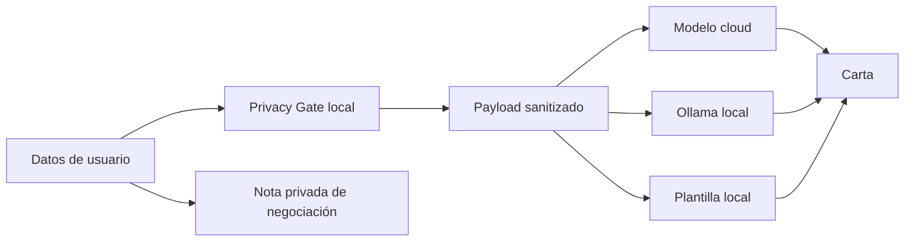

# Privacidad verificable en una app split brain: por qué el modelo no debe decidir qué sale del dispositivo

## Introducción

Una cover letter parece una aplicación sencilla para inteligencia artificial: se toma información de una persona, una oferta de trabajo y se genera una carta. El problema cambia cuando esa información incluye datos que una persona sí necesita para recibir asesoría, pero que no necesariamente debería enviar a un proveedor en la nube.

En este proyecto la persona puede escribir con franqueza cuánto gana, cuánto quiere ganar, dónde trabaja y qué busca. La aplicación debe devolver una carta de interés y una nota privada de negociación. La restricción más importante es que el salario actual **nunca puede salir del dispositivo**.

El proyecto utiliza una arquitectura **split brain**: ciertas tareas se resuelven localmente y otras en la nube. La separación no se hizo solo por tecnología, sino por riesgo, disponibilidad y calidad.

> **Captura sugerida 1:** formulario completo de la app.

## Qué significa split brain aquí

La aplicación tiene tres rutas de generación:



La nube recibe únicamente datos profesionales filtrados. El salario actual, salario deseado, empleador actual, nombre y contacto se quedan locales.

Esto responde a dos razones principales de split brain:

1. **Privacidad:** hay datos que no deben salir.
2. **Disponibilidad:** la aplicación debe seguir sirviendo sin conexión.

La nube se mantiene porque ofrece una ventaja real de **calidad** para redacción natural y adaptación al puesto.

## La decisión que cambió el diseño

Mi primera idea era separar el formulario en dos grupos: campos privados y campos permitidos para nube. Parecía suficiente.

El problema apareció al pensar como usuaria, no como desarrolladora. Aunque exista una casilla llamada “salario actual”, nada impide que alguien escriba otra vez el salario dentro de un campo libre como “logros”:

```text
Actualmente gano Q15,000 y coordino eventos...
```

Si el programa simplemente enviaba todos los campos “permitidos”, el salario se filtraba igual.

Ese fue el error de diseño más importante del proyecto: **clasificar campos no basta cuando existen entradas de texto libre**.

La corrección fue agregar una segunda barrera local y determinística.

## Dos barreras de privacidad

### Barrera 1: allowlist explícito

El código define exactamente qué claves pueden salir:

```python
CLOUD_ALLOWLIST = (
    "current_role_generic",
    "target_role",
    "target_company",
    "years_experience",
    "skills",
    "achievements",
    "motivation",
    "job_posting",
    "tone",
)
```

Esto es importante porque la privacidad no depende de que un modelo “entienda” qué es sensible. Si un campo no está en la lista, no se serializa.

### Barrera 2: redacción determinística

Antes de enviar cualquier texto libre se buscan y eliminan patrones como:

- correo;
- teléfono;
- montos monetarios;
- nombre exacto del usuario;
- empleador actual;
- valores exactos de salario actual y deseado.

Por ejemplo:

```text
Antes:
I earn Q15,000 at Private Robotics SA.

Después:
I earn [REDACTED_MONEY] at [REDACTED].
```

> **Captura sugerida 2:** expander de auditoría mostrando `[REDACTED_MONEY]`.

## Por qué no dejar que una IA clasifique lo sensible

Un modelo podría recibir el texto y decidir qué eliminar. Eso parece flexible, pero en este caso sería una mala frontera de seguridad.

Una regla de privacidad necesita ser:

- predecible;
- repetible;
- fácil de probar;
- independiente del humor o variación del modelo.

Una expresión regular no “entiende” el contexto, pero para un número con símbolo de moneda eso es una ventaja: hace exactamente la misma cosa cada vez.

La aplicación puede usar IA para redactar mejor; no la necesita para decidir si el salario sale de la computadora.

## La nota de negociación vive en otro cerebro

La segunda salida de la app usa justamente los datos que más quiero proteger: salario actual y salario deseado.

Por eso no comparte la misma ruta de la carta.

El cálculo se hace localmente:

```text
incremento % = (salario deseado / salario actual - 1) × 100
```

La app puede decir, por ejemplo, que la expectativa representa un aumento de 30% respecto al salario actual y sugerir no incluir compensación en la cover letter.

Esto no pretende sustituir datos de mercado. Solo compara dos valores privados y ofrece una guía de conversación.

## Qué pasa cuando la nube falla

Una arquitectura privada que deja de funcionar en cuanto no hay internet tampoco cumple bien el reto.

La app usa esta cascada:

```text
OpenAI cloud
    ↓ si falla
Ollama + Qwen local
    ↓ si falla
plantilla determinística
```

El último fallback no es espectacular, pero siempre puede producir algo como:

- saludo;
- interés en el puesto;
- habilidades relevantes;
- logro;
- motivación;
- cierre profesional.

Eso demuestra que “offline útil” no tiene que significar “offline idéntico”.

> **Captura sugerida 3:** misma entrada generada con cloud y con `local-template`.

## Validación con 15 perfiles ficticios

Mi área de profundidad fue aprendizajes y validación. Para no probar la privacidad solo con un ejemplo, construí 15 perfiles ficticios.

Cada perfil incluye secretos plantados:

- nombre;
- empleador;
- salario actual;
- salario deseado;
- correo;
- teléfono.

Además, algunos secretos se repiten dentro de texto libre para simular errores humanos.

En total se revisaron 120 valores sensibles.

Resultado de la barrera de privacidad en la versión actual:

```text
120/120 bloqueados
100% de captura en este set de prueba
```

Este número no significa que el sistema sea perfecto contra cualquier dato personal. Significa algo más concreto y defendible: **en el conjunto de casos definido, todos los secretos plantados fueron detenidos antes del payload cloud**.

## Cómo medí la calidad

Para evitar decir simplemente “esta carta se siente mejor”, definí una rúbrica de 12 puntos:

- especificidad al rol/empresa;
- uso de habilidades y evidencia;
- motivación;
- estructura profesional;
- longitud adecuada;
- privacidad.

El fallback determinístico obtuvo 11/12 de promedio en los 15 casos. Su ventaja fue latencia casi nula y disponibilidad total; su desventaja fue una redacción más repetitiva.

La misma herramienta ejecuta Ollama y el modelo cloud sobre los mismos 15 casos. Eso permite comparar las tres rutas sin cambiar las entradas ni la rúbrica.

> **Captura sugerida 4:** terminal mostrando `python scripts/run_validation.py --mode all`.

## Qué aprendí

El aprendizaje principal no fue “cómo llamar una API”. Fue aprender que una arquitectura de IA puede dividir responsabilidades según qué tarea necesita inteligencia y cuál necesita certeza.

Para redactar una carta, un modelo grande aporta valor.

Para impedir que un salario salga del equipo, prefiero una regla que pueda leer, probar y romper con un test.

Para seguir funcionando sin internet, un modelo local es útil.

Para seguir funcionando incluso sin ese modelo, una plantilla simple es suficiente.

Eso es split brain en este proyecto: no dos modelos por moda, sino varias herramientas con responsabilidades diferentes.

## Prueba didáctica

El proyecto también exige que una persona que nunca lo haya visto pueda ejecutarlo solo con el README.

Para esa prueba preparé una hoja en `DIDACTIC_TEST.md`. El primer intento debe hacerse sin ayuda verbal. Cada bloqueo se convierte en una mejora concreta al README.

Esa parte es importante porque una instalación que solo funciona cuando la autora está al lado no es realmente reproducible.

> **Captura sugerida 5:** fragmento del README corregido después de la prueba.

## Conclusión

Una app con IA no debería enviar todo a la nube solo porque puede hacerlo. La arquitectura puede decidir qué necesita calidad, qué necesita privacidad y qué necesita seguir funcionando cuando algo falla.

En esta cover letter, el modelo cloud escribe; el código local protege; Ollama mantiene disponibilidad; y una plantilla determinística garantiza una última salida útil.

El resultado más importante es que esa división no solo se explica: se puede inspeccionar y probar.

---

# Tres temas que merecen un artículo propio

## Prioridad 1 — “Un allowlist no basta: cómo se filtran secretos por campos de texto libre”

**A quién le sirve:** personas que construyen formularios con LLMs, estudiantes y desarrolladores junior.

**Qué aprende:** por qué separar campos sensibles y no sensibles no evita fugas cuando la persona puede volver a escribir datos privados dentro de texto libre; cómo combinar allowlist y redacción determinística.

**Por qué vale la pena:** el set de validación plantó secretos dentro de `achievements` y `job_posting`, y la segunda barrera fue necesaria para bloquearlos.

**Evidencia:** 120 secretos plantados revisados; 120 bloqueados en el set actual.

## Prioridad 2 — “Tres niveles de fallback para una app de IA: cloud, modelo local y cero modelo”

**A quién le sirve:** personas que quieren aplicaciones de IA resistentes a fallas o conectividad limitada.

**Qué aprende:** cómo diseñar degradación progresiva sin que la app pase de “inteligente” a “inútil” cuando falla una API.

**Por qué vale la pena:** el proyecto implementa tres rutas reales y permite medir calidad y latencia sobre exactamente las mismas entradas.

**Evidencia:** fallback determinístico evaluado en 15 casos con 11/12 promedio y latencia prácticamente nula; el script deja preparada la comparación con Ollama y nube.

## Prioridad 3 — “El README también es una interfaz: cómo probar documentación con una persona nueva”

**A quién le sirve:** estudiantes, equipos open source y personas que publican proyectos técnicos para evaluación.

**Qué aprende:** cómo convertir bloqueos de instalación en mejoras de documentación mediante una prueba de usuario simple.

**Por qué vale la pena:** una app reproducible necesita que otra persona pueda levantarla sin ayuda de quien la escribió.

**Evidencia:** `DIDACTIC_TEST.md` registra el primer intento, los puntos de fricción, los cambios al README y el segundo intento.
