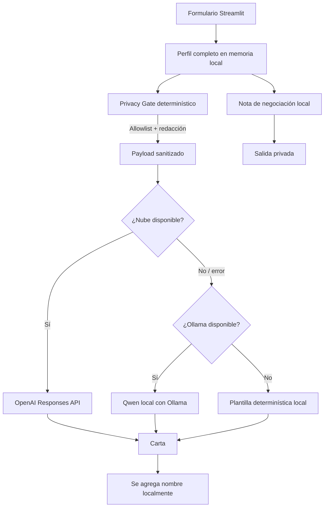

# Split-Brain Cover Letter — Emily

App en Python + Streamlit que genera una carta de interés y una nota privada de negociación usando una arquitectura **split brain**.

La idea central es simple: **la nube se usa solo para lo que aporta calidad; los datos sensibles y las decisiones de privacidad permanecen locales**.

## 1. Qué hace la app

La persona llena un formulario con dos tipos de información:

- **Local / sensible:** nombre, correo, teléfono, empleador actual, salario actual, salario deseado y moneda.
- **Profesional / candidata a nube:** rol genérico actual, puesto objetivo, empresa objetivo, años de experiencia, habilidades, logros, motivación y oferta de trabajo.

La app devuelve:

1. Una **cover letter** lista para copiar o descargar.
2. Una **nota privada de negociación** que compara el salario deseado contra el actual.
3. Un **auditor de privacidad** que muestra exactamente qué payload se habría enviado a la nube.

## 2. Arquitectura split brain



### Qué corre dónde y por qué

| Componente | Dónde | Razón |
|---|---|---|
| Formulario y almacenamiento temporal | Local | Privacidad y control |
| Selección de campos permitidos | Local, determinística | Privacidad y capacidad de prueba |
| Redacción de salario/PII | Local, determinística | Privacidad; un modelo no decide qué sale |
| Nota de negociación | Local | Contiene salario actual y deseado |
| Cover letter principal | Nube | Calidad de redacción |
| Cover letter de respaldo | Local con Ollama | Disponibilidad sin internet |
| Último fallback | Local, sin modelo | Disponibilidad incluso sin Ollama |

Las dos razones principales del reparto son:

- **Privacidad:** el salario actual nunca sale del dispositivo.
- **Disponibilidad:** si la API o internet fallan, la app aún produce algo útil.

También hay una tercera razón: **calidad**. La nube se usa para la mejor versión de la carta cuando está disponible.

## 3. Decisión de privacidad: no la toma un modelo

El archivo `src/privacy.py` contiene una lista explícita de campos que sí pueden salir:

```python
CLOUD_ALLOWLIST = (
    "current_role_generic",
    "target_role",
    "target_company",
    "years_experience",
    "skills",
    "achievements",
    "motivation",
    "job_posting",
    "tone",
)
```

Todo lo demás queda fuera por diseño.

Además, antes de enviar texto libre, la app elimina de forma determinística:

- nombre de la persona;
- empleador actual;
- correo;
- teléfono;
- cantidades monetarias evidentes;
- salario actual y deseado si fueron repetidos dentro de un texto libre.

Esto se puede probar sin depender de IA.

## 4. Flujo de ejecución

```text
1. La persona llena el formulario.
2. Se construye CandidateProfile local.
3. build_cloud_payload() toma SOLO campos permitidos.
4. sanitize_text() elimina datos sensibles dentro de texto libre.
5. Si OPENAI_API_KEY existe:
      -> llama a OpenAI Responses API.
   Si falla:
      -> intenta Ollama local con Qwen.
   Si también falla:
      -> genera una carta con plantilla determinística.
6. El nombre se agrega al final localmente.
7. La nota de negociación se calcula aparte y nunca entra al payload cloud.
8. La app muestra el payload sanitizado para auditoría.
```

## 5. Estructura del repo

```text
cover-letter-split-brain-emily/
├─ app.py
├─ README.md
├─ ARTICLE.md
├─ DIDACTIC_TEST.md
├─ VALIDATION.md
├─ requirements.txt
├─ .env.example
├─ src/
│  ├─ models.py
│  ├─ privacy.py
│  ├─ prompts.py
│  ├─ generator.py
│  ├─ negotiation.py
│  └─ quality.py
├─ data/
│  └─ validation_cases.json
├─ scripts/
│  └─ run_validation.py
├─ tests/
│  ├─ test_privacy.py
│  ├─ test_offline.py
│  └─ test_quality.py
└─ results/
   └─ validation_results.json
```

## 6. Requisitos

- Windows, macOS o Linux.
- Python 3.11 o superior recomendado.
- Para modo nube: una API key propia de OpenAI.
- Para fallback con modelo local: Ollama instalado y un modelo descargado.

La app usa Streamlit porque permite construir formularios web desde Python con muy poco código. La documentación oficial de formularios está en: https://docs.streamlit.io/develop/api-reference/execution-flow/st.form


## 6.1 Importante: dónde ejecutarlo para que la privacidad sea real

Para la entrega principal, ejecuta la app **localmente en tu propia computadora** con VS Code + PowerShell. Así Streamlit, el filtro, la nota privada y Ollama corren en tu dispositivo.

**No presentes esta misma versión desplegada en Streamlit Community Cloud como prueba de que el salario nunca sale del dispositivo.** En un Streamlit hospedado, los valores del formulario llegan al servidor de Streamlit antes de que el código Python los filtre.

Para el requisito de “link al demo”, usa una de estas dos opciones y explícalo con claridad:

1. **Recomendado:** repo público + video corto de demo enlazado desde el README, ejecutando localmente con datos ficticios.
2. **Si te exigen URL interactiva:** publica una instancia marcada explícitamente como `DEMO WITH FAKE DATA ONLY`, sin pedir datos reales ni usarla como evidencia de privacidad. La demostración de privacidad se hace en la ejecución local y con los tests.

Esta distinción es una buena decisión de arquitectura para explicar en la presentación.

## 7. Instalación paso a paso en Windows

### Paso 1 — Instalar Python

Descarga Python desde https://www.python.org/downloads/

Durante la instalación marca:

```text
Add Python to PATH
```

Comprueba en PowerShell:

```powershell
python --version
```

### Paso 2 — Descargar este proyecto

Si está en GitHub:

```powershell
git clone TU_URL_DEL_REPO
cd cover-letter-split-brain-emily
```

O descarga el ZIP y abre PowerShell dentro de la carpeta.

### Paso 3 — Crear un entorno virtual

```powershell
python -m venv .venv
```

Activarlo:

```powershell
.\.venv\Scripts\Activate.ps1
```

Si PowerShell bloquea la activación, puedes usar CMD:

```cmd
.venv\Scripts\activate.bat
```

### Paso 4 — Instalar dependencias

```powershell
python -m pip install --upgrade pip
pip install -r requirements.txt
```

### Paso 5 — Crear tu archivo `.env`

Copia:

```text
.env.example
```

como:

```text
.env
```

El archivo debe verse así:

```env
OPENAI_API_KEY=tu_clave_aqui
OPENAI_MODEL=gpt-5.6-luna
OLLAMA_MODEL=qwen3:4b
OLLAMA_URL=http://localhost:11434/api/chat
CLOUD_TIMEOUT_SECONDS=25
LOCAL_TIMEOUT_SECONDS=90
```

**Nunca subas `.env` a GitHub.** Ya está incluido en `.gitignore`.

OpenAI recomienda guardar la API key en variables de entorno y no incluirla en repositorios ni en código cliente: https://help.openai.com/en/articles/5112595-best-practices-for-api-key-safety

## 8. Instalar Ollama para el fallback local

1. Instala Ollama desde https://ollama.com/
2. Abre PowerShell.
3. Descarga el modelo recomendado:

```powershell
ollama pull qwen3:4b
```

4. Verifica que funciona:

```powershell
ollama run qwen3:4b
```

Puedes salir con `Ctrl+d`.

La API local de Ollama se expone normalmente en:

```text
http://localhost:11434/api/chat
```

## 9. Ejecutar la app

Con el entorno virtual activo:

```powershell
streamlit run app.py
```

Se abrirá el navegador, normalmente en:

```text
http://localhost:8501
```

## 10. Cómo probar cada modo

### A. Modo nube

- Configura `OPENAI_API_KEY`.
- Deja marcada la opción **Use cloud model when available**.
- Genera la carta.
- Debe mostrar algo como:

```text
Generated by: cloud:...
```

### B. Fallback local con Ollama

Para simular falla de nube:

- elimina temporalmente `OPENAI_API_KEY` de `.env`, o desmarca la nube;
- deja Ollama encendido;
- genera otra carta.

Debe mostrar:

```text
Generated by: local-model:qwen3:4b
```

### C. Offline total

Para demostrar disponibilidad:

- desconecta internet;
- detén Ollama;
- genera una carta.

Debe mostrar:

```text
Generated by: local-template
```

La carta será más básica, pero seguirá siendo útil.

## 11. Pruebas automatizadas

Ejecuta:

```powershell
pytest -q
```

Las pruebas verifican, entre otras cosas:

- que el payload use exactamente el allowlist;
- que salario actual/deseado no salgan;
- que nombres, empleador, correo y teléfono plantados sean eliminados;
- que los 15 perfiles de validación pasen por la barrera de privacidad;
- que exista una salida útil sin red ni modelo.

Resultado esperado en la versión actual:

```text
6 passed
```

## 12. Validación de Emily: 15 perfiles ficticios

Los casos están en:

```text
data/validation_cases.json
```

Cada caso tiene datos sensibles plantados dentro de campos estructurados y también dentro de texto libre.

Ejecuta solo el fallback offline:

```powershell
python scripts/run_validation.py --mode offline
```

Ejecuta Ollama:

```powershell
python scripts/run_validation.py --mode local
```

Ejecuta nube:

```powershell
python scripts/run_validation.py --mode cloud
```

Ejecuta todo:

```powershell
python scripts/run_validation.py --mode all
```

La salida se guarda en:

```text
results/validation_results.json
```

## 13. Criterios para medir la calidad de las cartas

La evaluación usa una rúbrica reproducible de 12 puntos:

| Criterio | Puntos |
|---|---:|
| Menciona rol/empresa objetivo | 0–2 |
| Usa habilidades/evidencia | 0–2 |
| Refleja motivación | 0–2 |
| Estructura profesional | 0–2 |
| Longitud adecuada | 0–2 |
| No filtra datos sensibles | 0–2 |

El objetivo no es afirmar que esta rúbrica es universal. Sirve para comparar **las mismas entradas con los mismos criterios** entre nube, modelo local y fallback determinístico.

## 14. Resultado de validación ya ejecutado en esta versión

Se corrieron los 15 casos contra el fallback determinístico.

Resultado:

```text
15 casos evaluados
120 secretos plantados revisados
120/120 bloqueados antes del payload cloud
Tasa de captura: 100%
Promedio fallback determinístico: 11/12
```

Este resultado está guardado en `results/validation_results.json`.

Para completar la comparación **nube vs. Ollama**, corre:

```powershell
python scripts/run_validation.py --mode all
```

con tu API key y Ollama instalados. El mismo script agregará las métricas de ambos sin cambiar los casos ni la rúbrica.

## 15. Qué datos se envían a OpenAI

Solo el JSON sanitizado creado por `build_cloud_payload()`.

Nunca se envían deliberadamente:

```text
full_name
email
phone
current_employer
current_salary
desired_salary
currency
```

La app además muestra en pantalla el payload exacto para que pueda auditarse durante la demo.

## 16. Qué pasa si la API tarda o falla

La secuencia está implementada en `src/generator.py`:

```text
cloud -> Ollama -> plantilla local
```

No se queda bloqueada indefinidamente: hay timeouts configurables en `.env`.

## 17. API de nube

Se usa la **OpenAI Responses API**.

Conceptualmente la llamada es:

```python
from openai import OpenAI

client = OpenAI()
response = client.responses.create(
    model="gpt-5.6-luna",
    instructions="...",
    input="...payload sanitizado...",
)
```

La Responses API es la ruta moderna para integraciones de texto. Referencia oficial: https://platform.openai.com/docs/

## 18. Costo

El costo depende del modelo elegido y del volumen de tokens. Por eso el modelo está en `.env` y no fijado como una decisión irreversible.

Consulta precios actuales antes de entregar o presentar: https://platform.openai.com/pricing

La app reduce llamadas de pago con dos decisiones:

- una sola generación cloud por envío del formulario;
- fallback local si la nube no está disponible.

## 19. Demo sugerido para clase

Haz esta secuencia en vivo:

1. Llena `current_salary` con un valor claramente reconocible.
2. Repite ese mismo salario dentro de `achievements`.
3. Genera la carta con nube activa.
4. Abre **Audit: exactly what would be sent to cloud**.
5. Muestra que el salario fue reemplazado por `[REDACTED_MONEY]`.
6. Muestra la nota privada, donde sí aparece el salario.
7. Desconecta internet o borra temporalmente la API key.
8. Genera otra vez y enseña el fallback local.
9. Detén Ollama y vuelve a generar para mostrar la plantilla offline.

Eso demuestra las cuatro condiciones mínimas del reto de manera visible.

## 20. Prueba didáctica requerida

El archivo `DIDACTIC_TEST.md` contiene una hoja para que otra persona ejecute el proyecto usando únicamente este README.

**Importante:** esa parte no debe inventarse. Pídele a alguien que no haya visto el proyecto que lo corra, anota dónde se traba y corrige este README. Luego registra la segunda prueba.

## 21. Artículo

`ARTICLE.md` contiene un borrador completo enfocado en el tema:

> **Privacidad verificable en una app split brain: por qué el modelo no debe decidir qué sale del dispositivo**

Incluye el error/decisión real del proyecto: originalmente bastaba con separar campos, pero una persona podía volver a escribir su salario dentro de un texto libre; por eso se agregó una segunda barrera determinística de redacción antes del envío.

## 22. Tres temas adicionales de artículo

También están desarrollados y priorizados al final de `ARTICLE.md`.

## 23. Qué falta antes de entregar públicamente

Solo hay tres tareas que requieren tus propias cuentas o una persona externa:

1. Crear tu repo público en GitHub y subir estos archivos.
2. Conectar tu API key y ejecutar `--mode all` para registrar nube vs. local.
3. Hacer la prueba didáctica con otra persona y tomar las capturas para el artículo.

El código, las pruebas, los 15 casos, la arquitectura y el borrador del artículo ya están preparados.
